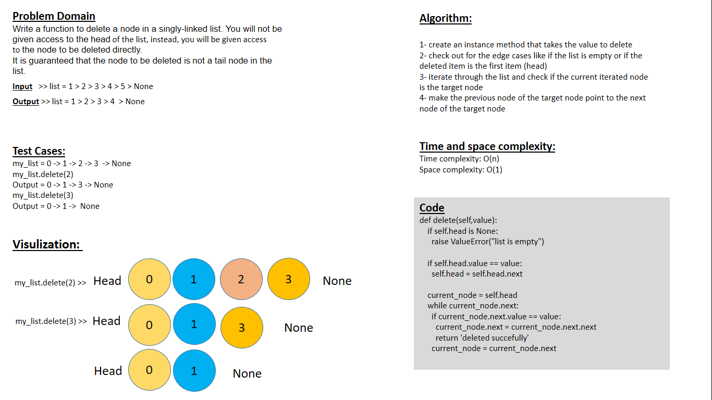

# note:
### in the challenge01.py file I had to write other method along with the delete method so I that I can test the delete function. it was so hard for me to figure out a way to test the delete method without other method like the appending method and the length method

